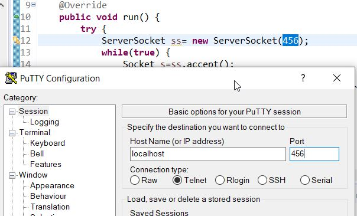
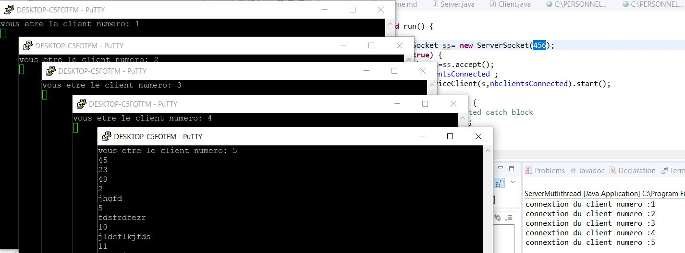

# Socket Multithread


## Configuration Server

Il faut hériter de la Class **Thread** et implémenter la Class **run**. A la connexion d'un client la méthode **main** créée un **In/Out** stream , puis démarre le thread avec la nouvelle socket et les flux stream in/out.  La Class **ServerClient** sera en communication avec le client.

```java
import java.io.IOException;
import java.net.ServerSocket;
import java.net.Socket;

public class ServerMutlithread extends  Thread{

	private int nbclientsConnected;
	
	@Override
	public void run() {
		try {
			ServerSocket ss= new ServerSocket(456);
			while(true) { 
				Socket s=ss.accept();
				++nbclientsConnected ; 
				new ServiceClient(s,nbclientsConnected).start();
			}
		} catch (IOException e) {
			// TODO Auto-generated catch block
			e.printStackTrace();
		}
		
	}
	
	public static void main(String[] args) {
		// TODO Auto-generated method stub
		new  ServerMutlithread().start();
		
	} 
}
```

Class **ServiceClient **

```java
import java.io.BufferedReader;
import java.io.IOException;
import java.io.InputStream;
import java.io.InputStreamReader;
import java.io.OutputStream;
import java.io.PrintWriter;
import java.net.Socket;

public class ServiceClient extends Thread {

	private int numeroClient;
	private Socket s;

	@Override
	public void run() {

		InputStream is;
		try {
			is = s.getInputStream();
			BufferedReader br = new BufferedReader(new InputStreamReader(is));
			OutputStream os = s.getOutputStream();
		    PrintWriter	pw = new PrintWriter(os,true);
		    System.out.println("connextion du client numero :" + numeroClient);
		    pw.println("vous etre le client numero: " + numeroClient);
		    while(true) {
		    	String req=br.readLine();
		    	pw.println(req.length());
		    	
		    }
		} catch (Exception e) {
			// TODO Auto-generated catch block
			e.printStackTrace();
		}

	}

	public ServiceClient(Socket s, int numeroClient) {
		super();
		this.numeroClient = numeroClient;
		this.s = s;
	}

	public ServiceClient() {
		super();
		// TODO Auto-generated constructor stub
	}

}

```

## Ouverture de plusieurs putty simultanément

Apres que le serveur soit démarré, faire un telnet sur le port défini puis lancer plusieurs sessions simultanément.



ouverture de plusieurs sessions




## Lancement du Server

Apres la connexion des différents clients 

Resultat server

```bash
connextion du client numero :1
connextion du client numero :2
connextion du client numero :3
connextion du client numero :4
connextion du client numero :5
```


